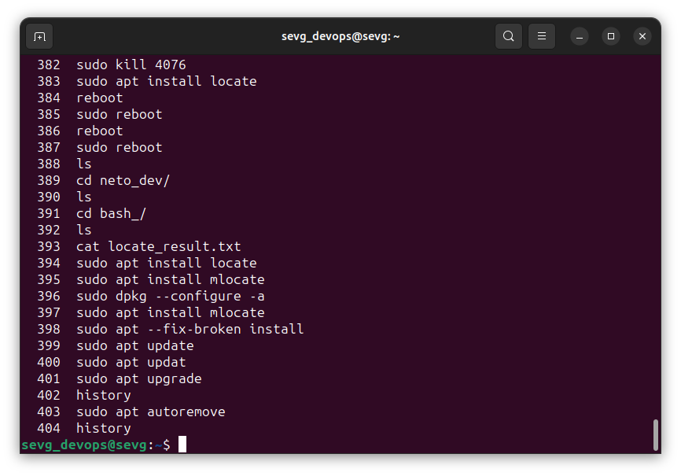
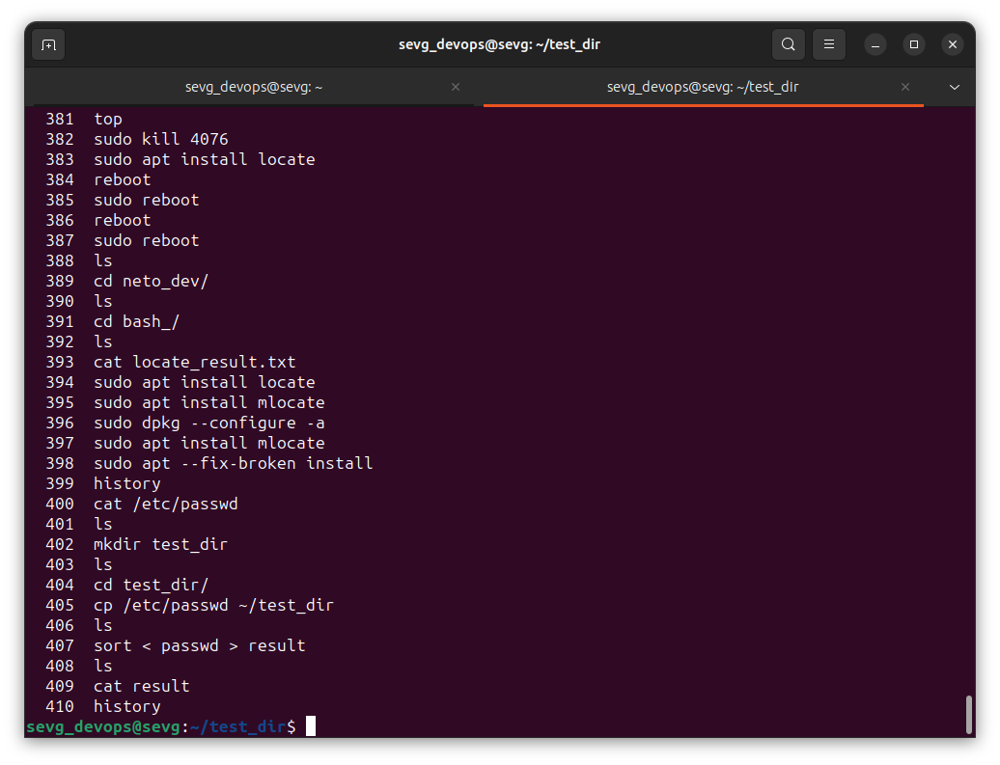
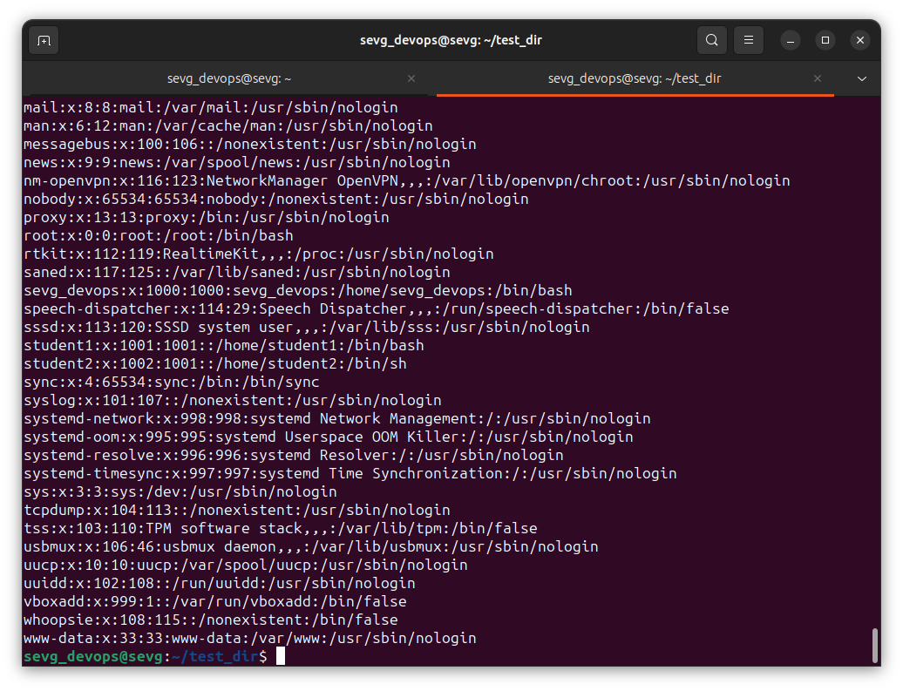

### Задание 1 (Установка Linux)

1. Установите Linux на виртуальную машину (см. ссылки 2 и 3 из предыдущего пункта)
2. Запустите терминал и обновите систему:
   1. Выполните команду **sudo apt update**
   2. Выполните команду **sudo apt dist-upgrade**
   3. Выполните команду **sudo apt autoremove**
   4. Выполните команду **sudo apt autoclean**

*Приведите ответ в виде снимка экрана с результатом выполнения команды **history** (история команд).*  

### Решение 1  
История команд (именно upgrade, так мне не нужно обновление дистрибутива =)):  

------

### Задание 2 (Работа с файлами)

1. Запустите терминал
2. Перейдите в свой домашний каталог (выполните команду **cd** без параметров)
3. Создайте каталог **test_dir**
4. Скопируйте в каталог **test_dir** файл **/etc/passwd**
5. Перейдите в каталог **test_dir**
6. Выполните команду **sort < passwd > result**
7. Что делает данная команда?

*Приведите ответ в виде снимка экрана с результатом выполнения команды **history** и пояснением в свободной форме.*

### Решение 2  

`sort < passwd`: Эта часть команды сортирует содержимое файла passwd и выводит результат на стандартный вывод.

`> result`: Этот фрагмент перенаправляет стандартный вывод (отсортированный результат) в файл с именем result в текущем каталоге (test_dir).

Таким образом, в результате выполнения этих команд получим отсортированную версию содержимого файла /etc/passwd, которая будет сохранена в файле result внутри каталога test_dir.  

История команд:  

Содержимое файла `result`:  

