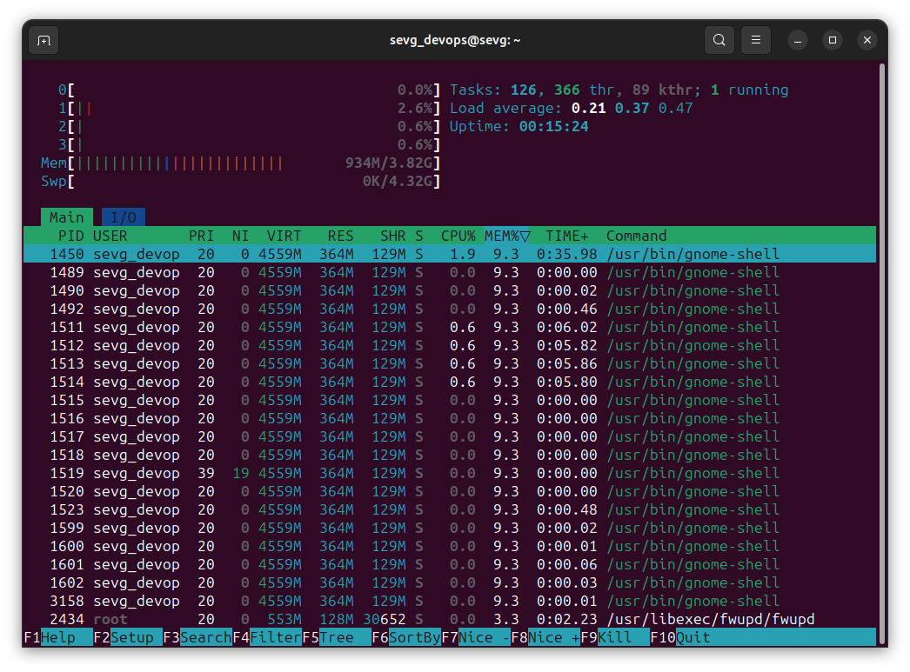
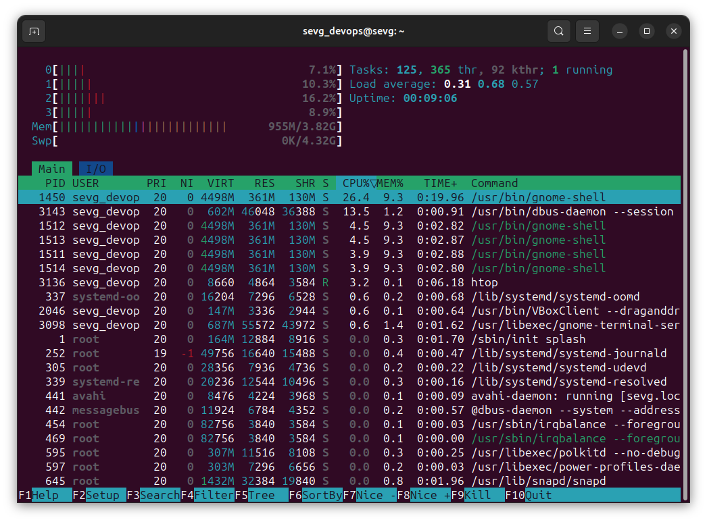
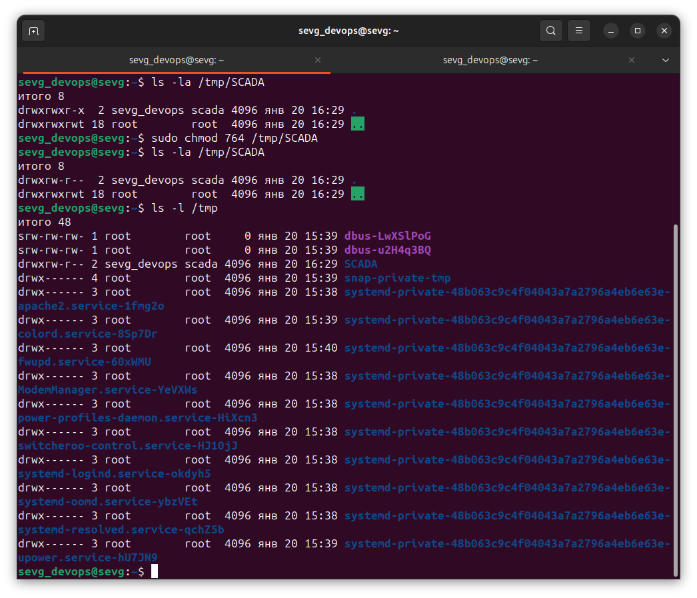
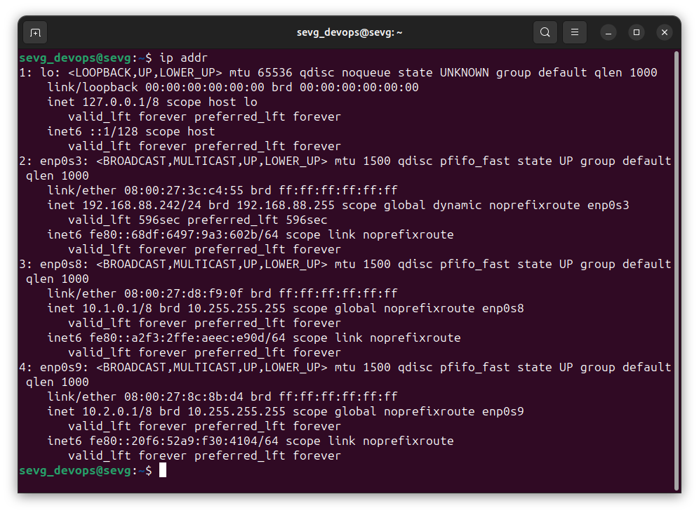

### Задание 1 (Работа с процессами)

1. **Установите утилиту htop.
2. С помощью htop ответьте на вопросы:
   * Какие процессы занимают больше всего памяти.
   * Какие процессы занимают больше всего процессорного времени.

*Приведите ответ в виде снимков экрана.*

### Решение 1  

1. Больше всего памяти занимает `/usr/bin/gnome-shell` (9.3%)

Также можно отсортировать по `VIRT` `RES` или `SHR`:
* `VIRT` (Virtual Memory): Общее количество виртуальной памяти, занимаемое процессом.
* `RES` (Resident Memory): Реальное физическое использование оперативной памяти (RAM) процессом.
* `SHR` (Shared Memory): Объем разделяемой памяти, который используется процессом.

Можно кликать мышкой по нужному столбцу, или нажать `F6` и выбрать нужный параметр для сортировки.

2. Больше всего процессорного времени занимает `/usr/bin/gnome-shell` (26.4%)

------

### Задание 2 (Работа с пользователями)

1. Создайте группу scada.
2. Создайте пользователя operator с оболочкой bash.
3. Добавьте пользователя operator в группу scada.
4. В папке /tmp создайте каталог SCADA.
5. Назначьте на этот каталог права доступа на редактирование для группы scada и чтение 
всем остальным.

*Приведите ответ в виде снимка экрана с результатом выполнения команды `ls -l /tmp`.*

### Решение 2  
  

----

### Задание 3 (Работа с сетью)

1. Добавьте в виртуальную машину два дополнительных сетевых адаптера с внутренней (internal) сетью.
2. Настройте на первом из них адрес `10.1.0.1` маску подсети `255.0.0.0`.
3. Настройте на втором из них адрес `10.2.0.1` маску подсети `255.0.0.0`.
4. На обоих интерфейсах настройте адрес dns-сервера как 8.8.8.8 и шлюз по умолчанию `10.1.1.1`.
5. Выполните команду `ip addr`.

*Приведите ответ в виде снимка экрана с выполненной командой `ip addr`.*

### Решение 3 

