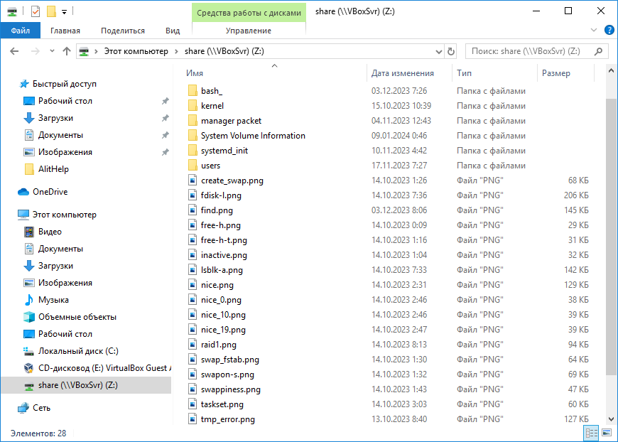
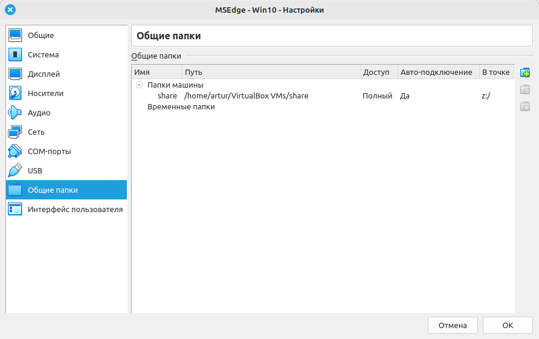
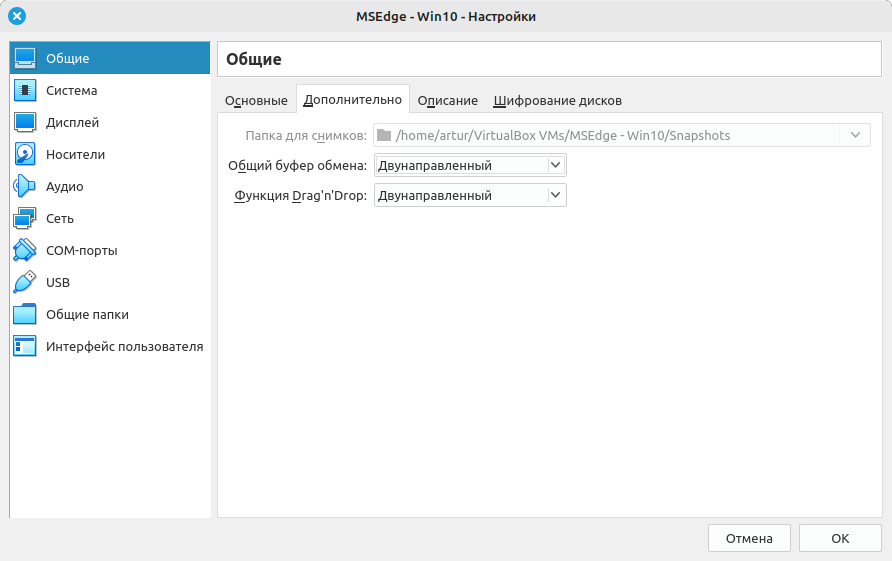
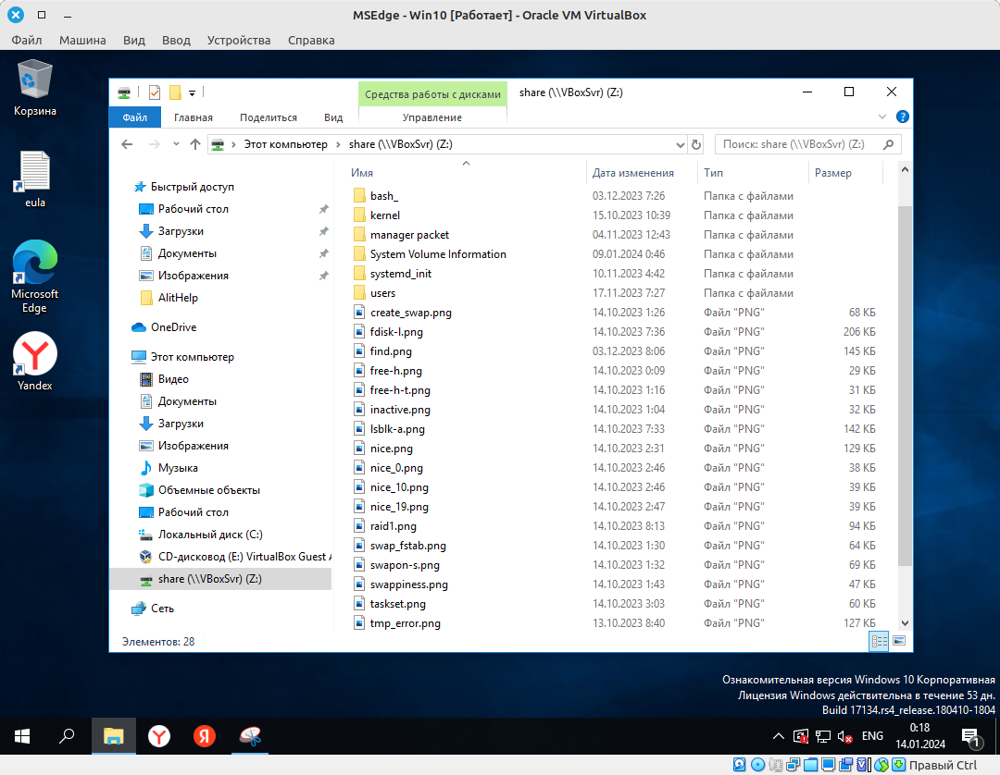
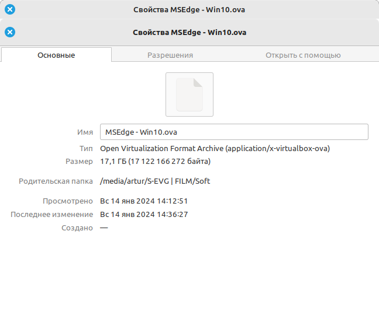
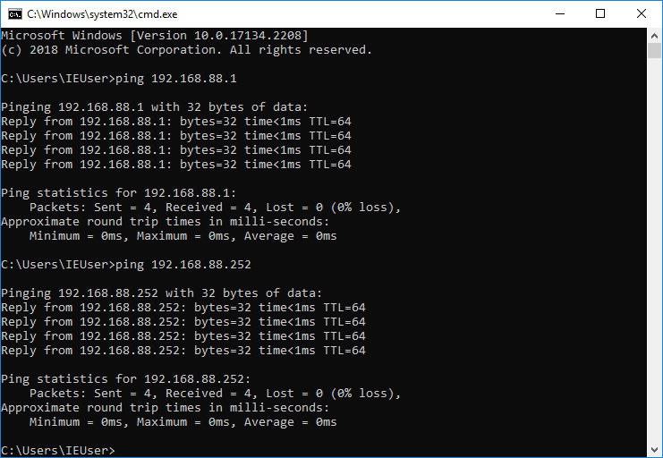
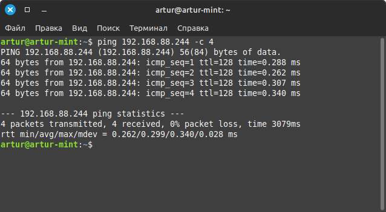

### Задание 1
1. Изучите материалы занятия.
2. Скачайте образ Windows 11 c официального сайта и установите его на виртуальную машину.
3. Настройте общую папку для обмена файлами с хостовой системой.
4. Настройте общий буфер обмена и функцию Drag & Drop для обмена файлами с хостовой операционной системой.
5. Выполните экспорт виртуальной машины в файл .ova.

 Результатом выполнения данного задания будет ссылка на следующие файлы:

* скриншот настроек общей папки;
* скриншот настроек общего буфера обмена и функции Drag & Drop;
* скриншот запущенной виртуальной машины;
* скриншот экспортированного файла .ova.

### Решение 1

Общая папка (вид из гостевой системы):  

Настройки общей папки:  

Настройки общего буфера обмена и функции Drag & Drop общей папки:  

Запущенная виртуальная машина:  

Экспортированный файл .ova:  

___

### Задание 2* (необязательное)
Произведите настройку локальной сети между хостовой и гостевой операционными системами согласно
[дополнительным материалам](https://losst.pro/nastrojka-seti-virtualbox).
Примечание: данная статья предназначена для Linux. Для Windows настройка будет аналогичной.

Выполните команду ping <host_ip_address> в командной строке операционной системы. В случае корректной настройки виртуальная сетевая карта инициирует обмен пакетами.
Результатом выполнения данного задания будет ссылка на следующие файлы:

* скриншот подтвержденного ping'а из гостевой системы;
* скриншот подтвержденного ping'а из хостовой системы.

ping из гостевой системы:  

ping из хостовой системы:  
